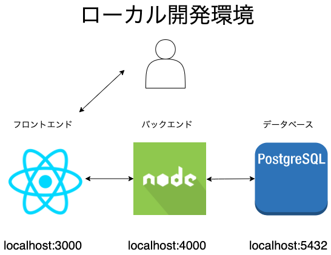

# 自己紹介
ゆうき(企画者)
---
# 伝えたいこと
どのようにしてサービスを完成させたか

---
# 作りたかったもの
非エンジニアとエンジニアをつなぐプラットフォーム
理由: 何か作りたいけど作りたいものがないエンジニア向けに非エンジニアの不満から何かアイデアを生み出せないかと思ったから。

---
# 出来たもの

掲示板(笑)

---
# 使用した技術

* フロントエンド: React
* バックエンド: Express(nodejs版のlaravelやrailsのようなもの)
* インフラ/db: Heroku/postgres

---
# 進め方
---
画面構成
|  URL  |  表示条件  |
| ---- | ---- |
|  /  |  誰でもみれる  |
|  /thread/comment:id  |  誰でもみれる  |
|  /login  |  未ログインのみ  |
|  /signup  |  未ログインのみ  |
|  /thread/create  |  ログイン済みのみ  |
|  /thread/edit:id  |  ログイン済みのみ  |
|  合計  |  6画面  |

---
<table>
<thead>
<tr>
<td>URL</td>
<td>表示条件</td>
</tr>
</thead>
<tbody>
<tr>
<td>/</td>
<td>誰でもみれる</td>
</tr>
<tr>
<td>/thread/comment:id</td>
<td>誰でもみれる</td>
</tr>
<tr>
<td>/login</td>
<td>未ログインのみ</td>
</tr>
<tr>
<td>/signup</td>
<td>未ログインのみ</td>
</tr>
<tr>
<td>/thread/create</td>
<td>ログイン済みのみ</td>
</tr>
<tr>
<td>/thread/edit/:id</td>
<td>ログイン済みのみ</td>
</tr>
<tr>
<td>合計</td>
<td>6画面</td>
</tr>

</tbody>
</table>
---
フロント側で必要な情報
1. ログインしているかどうか => accessToken 
2. 編集・削除が可能か => ユーザーID

---?code=yojigen-app/src/components/User.js&lang=javascript&title=ログインしてるかどうか
@[2](ローカルストレージにtokenがあるかどうか判定)

---?code=yojigen-app/src/components/GuestRoute.js&lang=javascript&title=ログインしてたら
@[9-12](accessTokenがないならlogin/signupページをロードできる)

---?code=yojigen-app/src/components/PrivateRoute.js&lang=javascript&title=ログインしてなかったら
@[9-12](accessTokenがあるならcreate/editページをロードできる)
---
ローカルでは全て違うポート番号
で作成します
  
---
本番ではExpressは静的ファイルを提供
＋
jsonを返すapiサーバー
としての役割します
  

* 初期
  * json-server+Express+postman
* 中期
  * json-server+Express+postman+React
* 末期
  * postgresDB+Express+React

---
# 本番デプロイ時

---
# コード側
* Express側
  * Procfileの作成(Expressサーバーの起動コマンド)
  * .envファイルに環境変数を記載
* React側
  * static.jsonの作成(heroku標準のwebpackから切り替えるため)

---
# heroku側
* githubとherokuの連携(任意)
* add-onの追加(postgres)
* 環境変数の追加(postgres環境変数とaccessToken変数)

---?code=package.json&lang=javascript&title=Express側のpackage.json
@[8](デプロイ時にReactのコードをbuildするように設定)

---?code=server.js&lang=javascript&title=Expressに追加
@[15](Expressサーバーは静的ファイルを出力)
@[385-387](これがないとlocalでは動くが、本番環境では動かない)

---
# 最後に
最後までありがとうございました。