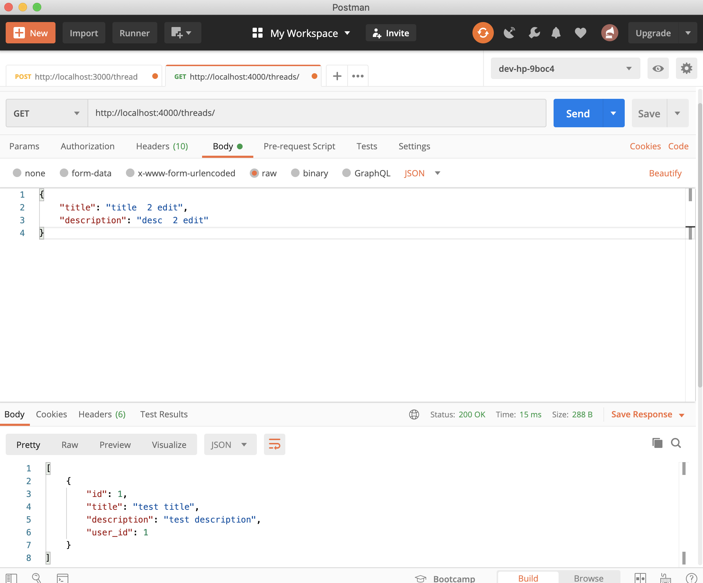
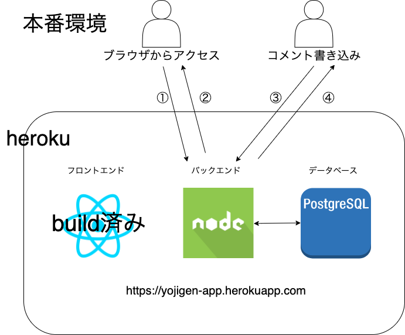
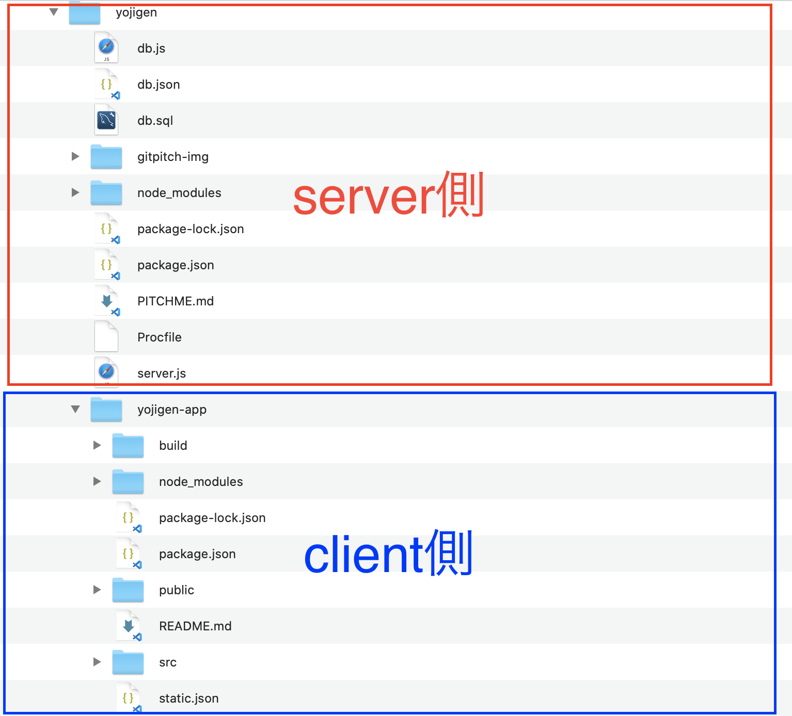
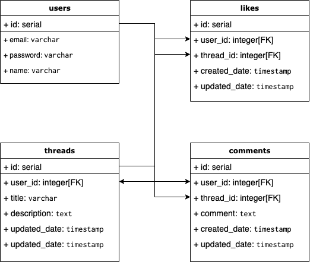

### Reactを使った開発のすすめ方
---
### 自己紹介
**名前**：ゆうき      
　  
**仕事**：アドテク系のWebの受託開発
　  
先月SES会社から転職し、 
7/16(木)入社

---
### 実際に作ったもの

<a href="https://yojigen-app.herokuapp.com/" target="_brank">リンク</a>

---
### 使用した技術

- フロントエンド: React |
- バックエンド: Express(nodejs版のlaravelやrailsのようなもの) |
- インフラ/db: Heroku/postgres |

---
### 進め方
---
Postmanを使い、バックエンドから開発
  
---
その後Reactでフロントページを作成し、herokuにデプロイ
---
ローカルでの動作環境

  

---
### 本番環境(heroku)
- build済みindex.htmlを返す
- データベースから返ってきたjsonを返す
  
---
フォルダ構成
  
---
### ER図(テーブル)
  
---
### つまり
- １つのスレッドには0 or 複数のコメントが結びついている |
- スレッド、コメント、いいねは[user_id]を紐付けて、誰がしたか分かる |
- ユーザがどのスレッドにいいね、またはコメントしたか分かる |

---
### フロント側画面構成
<table>
<thead>
<tr>
<td>URL</td>
<td>表示条件</td>
</tr>
</thead>
<tbody>
<tr>
<td>/</td>
<td>誰でもみれる</td>
</tr>
<tr>
<td>/thread/comment:id</td>
<td>誰でもみれる</td>
</tr>
<tr>
<td>/login</td>
<td>未ログインのみ</td>
</tr>
<tr>
<td>/signup</td>
<td>未ログインのみ</td>
</tr>
<tr>
<td>/thread/create</td>
<td>ログイン済みのみ</td>
</tr>
<tr>
<td>/thread/edit/:id</td>
<td>ログイン済みのみ</td>
</tr>
<tr>
<td>合計</td>
<td>6画面</td>
</tr>

</tbody>
</table>
---
### フロント側で必要な情報
1. ログインしているかどうか => accessToken 
2. 編集・削除が可能か => ユーザーID

---?code=yojigen-app/src/components/User.js&lang=javascript&title=login or not
@[2](ローカルストレージにtokenがあるかどうか判定)

---?code=yojigen-app/src/components/GuestRoute.js&lang=javascript&title=not
@[9-12](accessTokenがないならlogin/signupページをロードできる)

---?code=yojigen-app/src/components/PrivateRoute.js&lang=javascript&title=login
@[9-12](accessTokenがあるならcreate/editページをロードできる)

---
フロント作成時にぶち当たった壁

---
### 本番デプロイ時

---
### コード側
* Express側
  * Procfileの作成(Expressサーバーの起動コマンド)
  * .envファイルに環境変数を記載
* React側
  * static.jsonの作成(heroku標準のwebpackから切り替えるため)

---
### heroku側
* githubとherokuの連携(任意)
* add-onの追加(postgres)
* 環境変数の追加(postgres環境変数とaccessToken変数)

---?code=package.json&lang=javascript&title=Express側のpackage.json
@[8](デプロイ時にReactのコードをbuildするように設定)

---?code=server.js&lang=javascript&title=Expressに追加
@[15](Expressサーバーは静的ファイルを出力)
@[385-387](これがないとlocalでは動くが、本番環境では動かない)

---
最後までありがとうございました。